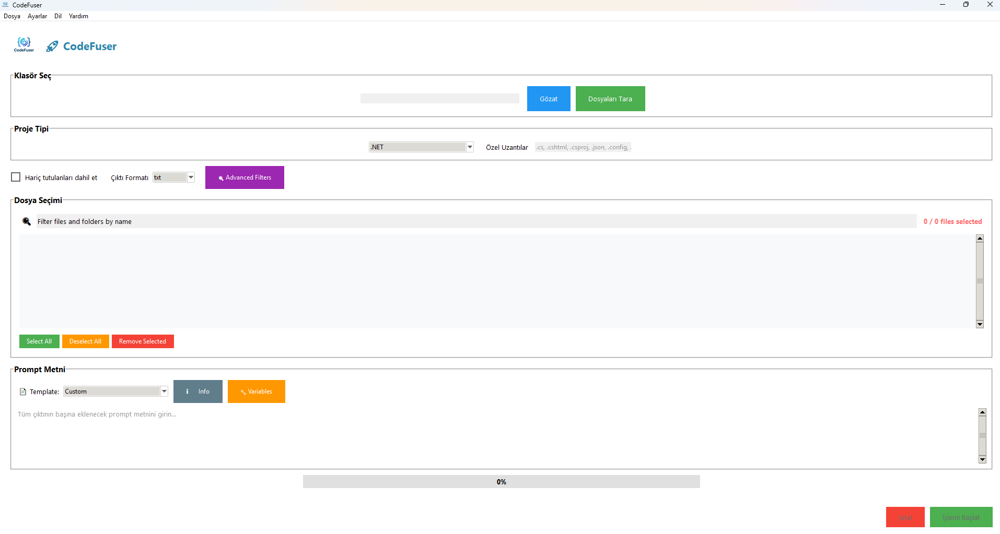

# 🚀 CodeFuser v2.0 / KodBirleştirici v2.0



**English** | [Türkçe](#-türkçe-v20)

---

## **The Ultimate AI-Powered Code Aggregation Tool with File-Specific Prompts**

CodeFuser v2.0 is a revolutionary application that combines project files into AI-ready outputs with **file-specific custom prompts**, advanced filtering, template systems, and multi-format export capabilities. Perfect for AI development workflows, code analysis, and documentation generation.

<div align="center">
  
  <br>
  <em>Your ultimate AI-powered code aggregation companion</em>
  <br><br>
  <strong>⭐ NEW in v2.0: File-Specific Custom Prompts!</strong>
</div>

## ✨ What's New in v2.0

### 🎯 **File-Specific Custom Prompts** (Revolutionary Feature!)
- **Individual File Instructions**: Click the 📄 icon next to any file to add custom prompts
- **Smart Visual Indicators**: Files with prompts show 📝✨ and highlighted colors
- **Intelligent Color Coding**:
  - 🟢 **Green**: Selected + Custom Prompt (Perfect!)
  - 🟡 **Yellow**: Selected Only (Good)
  - 🔴 **Red**: Prompt Only (Warning - unused prompt)
- **Advanced Usage Statistics**: Track prompt usage with detailed counters
- **Export Integration**: All formats (TXT, HTML, DOCX, PDF) include file-specific prompts

### 🚀 **Standalone Windows EXE** 
- **Zero Dependencies**: Run without Python installation
- **Single File Distribution**: 22MB portable executable
- **Instant Deployment**: Copy to any Windows machine and run
- **Professional Packaging**: Complete with bilingual documentation

### 🎨 **Enhanced User Experience**
- **Improved Layout**: Better spacing between checkboxes and icons
- **Optimized Click Detection**: Precise icon interaction areas
- **Responsive Dialog Windows**: Fixed button positioning in all screen sizes
- **Visual Feedback**: Real-time color updates based on file status

## 🏆 Why Choose CodeFuser v2.0?

### 🎯 **Perfect for AI Development**
```
Traditional tools: "Here's my entire codebase"
CodeFuser v2.0: "Here's my codebase with specific instructions for each critical file"

Example:
├── main.py → "Focus on the authentication logic"
├── api.py → "Analyze security vulnerabilities" 
├── utils.py → "Suggest performance optimizations"
└── config.py → "Review configuration best practices"
```

### 🔍 **Advanced Intelligence**
- **30+ Smart Filters**: Git integration, code quality analysis, file type detection
- **Professional Templates**: 16x Prompt, Claude Project, Code Review, Documentation
- **Multi-Format Export**: TXT, HTML (with syntax highlighting), DOCX, PDF
- **Bilingual Support**: Complete Turkish and English interfaces

### 💼 **Enterprise Ready**
- **Standalone Deployment**: No IT approval needed for dependencies
- **Configurable Settings**: Customize for team workflows
- **Professional Output**: Beautiful formatted exports for documentation
- **Version Control Integration**: Git status-based filtering

## 🚀 Installation & Quick Start

### 📥 Method 1: Standalone Windows EXE (Recommended)

**For everyone - no technical knowledge required:**

1. **Download**
   - Go to [Releases](https://github.com/tahamucasiroglu/CodeFuser/releases)
   - Download `CodeFuser_Portable.zip` (latest version)
   - Extract the ZIP file

2. **Run**
   - Open the extracted folder
   - Double-click `CodeFuser.exe`
   - Program starts instantly! ⚡

3. **First Use**
   - Click "Browse" → Select your project folder
   - Click "Scan Files" → Discover all code files
   - Select files with checkboxes ☑️
   - **NEW**: Click 📄 icons to add file-specific prompts
   - Choose template or write custom prompt
   - Click "Start Process" → Get your AI-ready output!

### 🔧 Method 2: Python Source (For Developers)

```bash
# Clone repository
git clone https://github.com/tahamucasiroglu/CodeFuser.git
cd codefuser

# Install dependencies
pip install -r requirements.txt

# Run application
python main.py

# Build standalone EXE
python build_exe.py
```

## 📖 Advanced Usage Examples

### 🤖 AI Code Analysis Workflow
```
1. Select your project files
2. Add file-specific prompts:
   📄 main.py → "Analyze the main application flow"
   📄 auth.py → "Review security implementations"
   📄 utils.py → "Suggest performance improvements"
3. Use "16x Prompt" template for AI interaction
4. Export as HTML for easy copying to AI tools
5. Get targeted, intelligent analysis for each file!
```

### 🔍 Code Review Process
```
1. Use Git filter → Show only modified files
2. Select "Code Review" template
3. Add specific review prompts:
   📄 new_feature.py → "Check for edge cases and error handling"
   📄 updated_api.py → "Verify backward compatibility"
4. Export as DOCX for team distribution
5. Comprehensive, targeted code review ready!
```

### 📚 Documentation Generation
```
1. Filter for main files and documentation
2. Use "Documentation" template
3. Add documentation prompts:
   📄 core_module.py → "Generate API documentation"
   📄 helpers.py → "Create usage examples"
4. Export as HTML with beautiful syntax highlighting
5. Professional documentation ready to share!
```

## ⚙️ Advanced Configuration

### Project-Specific Settings (`config/user_settings.json`)
```json
{
  "project_types": {
    "React": [".js", ".jsx", ".ts", ".tsx", ".css", ".scss"],
    "Python": [".py", ".pyx", ".pyi", ".ipynb"],
    "C#": [".cs", ".cshtml", ".csproj", ".config"]
  },
  "smart_filters": {
    "exclude_tests": true,
    "include_documentation": true,
    "max_file_size_mb": 5
  },
  "output_preferences": {
    "default_format": "html",
    "include_file_stats": true,
    "syntax_highlighting": true
  }
}
```

### Template Customization
```json
{
  "template_name": "My Custom Template",
  "variables": {
    "project_name": "{{PROJECT_NAME}}",
    "analysis_type": "{{ANALYSIS_TYPE}}"
  },
  "prompt": "Analyze {{PROJECT_NAME}} focusing on {{ANALYSIS_TYPE}}"
}
```

## 📊 Feature Comparison

| Feature | CodeFuser v2.0 | CodeFuser v1.0 | Competitors |
|---------|----------------|----------------|-------------|
| **File-Specific Prompts** | ✅ Revolutionary | ❌ Not Available | ❌ Not Available |
| **Visual Color Coding** | ✅ Advanced | ❌ Basic | ❌ None |
| **Standalone EXE** | ✅ 22MB Portable | ❌ Python Required | ❌ Various |
| **Export Formats** | ✅ 4 Professional | ✅ 4 Basic | ❌ 1-2 Basic |
| **Smart Filters** | ✅ 30+ Filters | ✅ 20+ Filters | ❌ Basic |
| **Templates** | ✅ 5+ Professional | ✅ 3 Basic | ❌ None/Basic |
| **Multi-Language** | ✅ Turkish/English | ✅ Turkish/English | ❌ English Only |
| **Git Integration** | ✅ Full Featured | ✅ Basic | ❌ None |

## 🔧 Building from Source

### Windows EXE Build
```bash
# All dependencies included automatically
python build_exe.py

# Output: CodeFuser_Portable/CodeFuser.exe (22MB)
# Includes: Bilingual README files, all assets
```

### Development Setup
```bash
git clone https://github.com/tahamucasiroglu/CodeFuser.git
cd codefuser
pip install -r requirements.txt

# Run tests
python -m pytest tests/

# Run application
python main.py
```

## 🗺️ Roadmap

### 🎯 Version 2.1 (Next Release)
- [ ] **Prompt Templates Library**: Shareable file-specific prompt collections
- [ ] **Bulk Prompt Assignment**: Apply prompts to multiple files by pattern
- [ ] **Prompt History**: Remember and reuse previous file prompts
- [ ] **Advanced Export Options**: Custom styling and formatting

### 🚀 Version 2.2 (Major Update)
- [ ] **AI Integration**: Direct ChatGPT/Claude API with file-specific prompts
- [ ] **Collaborative Prompts**: Share and sync prompts across team
- [ ] **Smart Prompt Suggestions**: AI-powered prompt recommendations
- [ ] **Workflow Automation**: Save and replay complete analysis workflows

### 🔮 Version 3.0 (Future Vision)
- [ ] **Web Interface**: Browser-based version with real-time collaboration
- [ ] **Plugin Ecosystem**: Third-party extensions and integrations
- [ ] **Enterprise Features**: SSO, audit logs, compliance reporting
- [ ] **Advanced Analytics**: Code quality trends and insights

## 💡 Pro Tips

### 🎯 **Maximizing File-Specific Prompts**
```
✅ DO:
- Use specific, actionable prompts
- Focus on file's primary purpose
- Include context about expected output
- Use different prompt styles for different file types

❌ DON'T:
- Use generic prompts for all files
- Create prompts for files you won't select
- Make prompts too long or complex
- Forget to check the color coding
```

### 🚀 **Efficient Workflows**
```
1. Start with file selection (yellow background)
2. Add specific prompts to critical files (green background)
3. Review red backgrounds (unused prompts)
4. Use templates for consistent formatting
5. Export in format that matches your workflow
```

## 🤝 Contributing

We welcome contributions to make CodeFuser even better!

### Development Areas
- **File-Specific Features**: Enhanced prompt management
- **Export Formats**: New output formats and styling
- **Smart Filters**: Advanced code analysis capabilities
- **Templates**: Professional prompt templates
- **Internationalization**: Additional language support

### Getting Started
```bash
# Fork the repository
git clone https://github.com/tahamucasiroglu/CodeFuser.git
cd codefuser

# Create feature branch
git checkout -b feature/amazing-new-feature

# Make your changes
# Add tests
# Update documentation

# Submit pull request
```

## 📞 Support & Community

- **🐛 Bug Reports**: [GitHub Issues](https://github.com/tahamucasiroglu/CodeFuser/issues)
- **💡 Feature Requests**: [GitHub Discussions](https://github.com/tahamucasiroglu/CodeFuser/discussions)
- **📖 Documentation**: [Wiki](https://github.com/tahamucasiroglu/CodeFuser/wiki)

## 📝 License

MIT License - see [LICENSE](LICENSE) file for details.

## 🙏 Acknowledgments

- **Inspired by**: 16x Prompt, PasteMax, and the AI development community
- **Built with**: Python, Tkinter, PIL, ReportLab, python-docx
- **Special thanks**: Turkish developer community for feedback and support

---

**Made with ❤️ for developers worldwide**

*CodeFuser v2.0 - Fuse your code with AI precision*

---

# 🇹🇷 Türkçe v2.0

[English](#-codefuser-v20--kodbirleştirici-v20) | **Türkçe**

---

## **Dosya Bazında Özel Prompt'larla Yapay Zeka Destekli Üstün Kod Birleştirme Aracı**

CodeFuser v2.0, proje dosyalarını **dosya bazında özel prompt'lar**, gelişmiş filtreleme, şablon sistemleri ve çoklu format dışa aktarma özellikleriyle yapay zeka için hazır çıktılarda birleştiren devrimci bir uygulamadır. Yapay zeka geliştirme iş akışları, kod analizi ve dokümantasyon oluşturma için mükemmeldir.

<div align="center">
  
  <br>
  <em>Yapay zeka destekli üstün kod birleştirme arkadaşınız</em>
  <br><br>
  <strong>⭐ v2.0'da YENİ: Dosya Bazında Özel Prompt'lar!</strong>
</div>

## ✨ v2.0'daki Yenilikler

### 🎯 **Dosya Bazında Özel Prompt'lar** (Devrimci Özellik!)
- **Bireysel Dosya Talimatları**: Herhangi bir dosyaya özel prompt eklemek için 📄 ikonuna tıklayın
- **Akıllı Görsel Göstergeler**: Prompt'u olan dosyalar 📝✨ ve vurgulanan renklerle gösterilir
- **Zeki Renk Kodlama**:
  - 🟢 **Yeşil**: Seçili + Özel Prompt (Mükemmel!)
  - 🟡 **Sarı**: Sadece Seçili (İyi)
  - 🔴 **Kırmızı**: Sadece Prompt (Uyarı - kullanılmayan prompt)
- **Gelişmiş Kullanım İstatistikleri**: Detaylı sayaçlarla prompt kullanımını takip edin
- **Dışa Aktarma Entegrasyonu**: Tüm formatlar (TXT, HTML, DOCX, PDF) dosya bazında prompt'ları içerir

### 🚀 **Bağımsız Windows EXE** 
- **Sıfır Bağımlılık**: Python kurulumu olmadan çalışır
- **Tek Dosya Dağıtımı**: 22MB taşınabilir çalıştırılabilir dosya
- **Anında Dağıtım**: Herhangi bir Windows makinesine kopyalayın ve çalıştırın
- **Profesyonel Paketleme**: İki dilli dokümantasyonla birlikte tamamlanmış

### 🎨 **Gelişmiş Kullanıcı Deneyimi**
- **Gelişmiş Düzen**: Checkbox'lar ve ikonlar arasında daha iyi boşluklar
- **Optimize Edilmiş Tıklama Algılama**: Hassas ikon etkileşim alanları
- **Duyarlı Dialog Pencereleri**: Tüm ekran boyutlarında sabit buton konumlandırma
- **Görsel Geri Bildirim**: Dosya durumuna göre gerçek zamanlı renk güncellemeleri

## 🏆 Neden CodeFuser v2.0?

### 🎯 **Yapay Zeka Geliştirme İçin Mükemmel**
```
Geleneksel araçlar: "İşte tüm kod tabanım"
CodeFuser v2.0: "İşte her kritik dosya için özel talimatlarla kod tabanım"

Örnek:
├── main.py → "Kimlik doğrulama mantığına odaklan"
├── api.py → "Güvenlik açıklarını analiz et" 
├── utils.py → "Performans optimizasyonları öner"
└── config.py → "Konfigürasyon en iyi uygulamalarını incele"
```

### 🔍 **Gelişmiş Zeka**
- **30+ Akıllı Filtre**: Git entegrasyonu, kod kalitesi analizi, dosya türü tespiti
- **Profesyonel Şablonlar**: 16x Prompt, Claude Project, Code Review, Documentation
- **Çoklu Format Dışa Aktarım**: TXT, HTML (sözdizimi vurgulamalı), DOCX, PDF
- **İki Dilli Destek**: Tam Türkçe ve İngilizce arayüzler

### 💼 **Kurumsal Hazır**
- **Bağımsız Dağıtım**: Bağımlılıklar için IT onayı gerektirmez
- **Yapılandırılabilir Ayarlar**: Takım iş akışları için özelleştirin
- **Profesyonel Çıktı**: Dokümantasyon için güzel formatlı dışa aktarmalar
- **Versiyon Kontrol Entegrasyonu**: Git durumu tabanlı filtreleme

## 🚀 Kurulum ve Hızlı Başlangıç

### 📥 Yöntem 1: Bağımsız Windows EXE (Önerilen)

**Herkes için - teknik bilgi gerektirmez:**

1. **İndirin**
   - [Sürümler](https://github.com/tahamucasiroglu/CodeFuser/releases) sayfasına gidin
   - `CodeFuser_Portable.zip` dosyasını indirin (en son versiyon)
   - ZIP dosyasını çıkartın

2. **Çalıştırın**
   - Çıkartılan klasörü açın
   - `CodeFuser.exe` dosyasına çift tıklayın
   - Program anında başlar! ⚡

3. **İlk Kullanım**
   - "Gözat" → Proje klasörünüzü seçin
   - "Dosyaları Tara" → Tüm kod dosyalarını keşfedin
   - Checkbox'larla dosyaları seçin ☑️
   - **YENİ**: Dosya bazında prompt eklemek için 📄 ikonlarına tıklayın
   - Şablon seçin veya özel prompt yazın
   - "İşlemi Başlat" → Yapay zeka için hazır çıktınızı alın!

### 🔧 Yöntem 2: Python Kaynağı (Geliştiriciler İçin)

```bash
# Repository'yi klonlayın
git clone https://github.com/tahamucasiroglu/CodeFuser.git
cd codefuser

# Bağımlılıkları kurun
pip install -r requirements.txt

# Uygulamayı çalıştırın
python main.py

# Bağımsız EXE derleyin
python build_exe.py
```

## 📖 Gelişmiş Kullanım Örnekleri

### 🤖 Yapay Zeka Kod Analizi İş Akışı
```
1. Proje dosyalarınızı seçin
2. Dosya bazında prompt'lar ekleyin:
   📄 main.py → "Ana uygulama akışını analiz et"
   📄 auth.py → "Güvenlik implementasyonlarını incele"
   📄 utils.py → "Performans iyileştirmeleri öner"
3. Yapay zeka etkileşimi için "16x Prompt" şablonunu kullanın
4. Yapay zeka araçlarına kolay kopyalama için HTML olarak dışa aktarın
5. Her dosya için hedefli, zeki analiz alın!
```

### 🔍 Kod İnceleme Süreci
```
1. Git filtresi kullanın → Sadece değiştirilmiş dosyaları gösterin
2. "Code Review" şablonunu seçin
3. Özel inceleme prompt'ları ekleyin:
   📄 new_feature.py → "Uç durumları ve hata işlemeyi kontrol et"
   📄 updated_api.py → "Geriye dönük uyumluluğu doğrula"
4. Takım dağıtımı için DOCX olarak dışa aktarın
5. Kapsamlı, hedefli kod incelemesi hazır!
```

### 📚 Dokümantasyon Oluşturma
```
1. Ana dosyalar ve dokümantasyon için filtreleyin
2. "Documentation" şablonunu kullanın
3. Dokümantasyon prompt'ları ekleyin:
   📄 core_module.py → "API dokümantasyonu oluştur"
   📄 helpers.py → "Kullanım örnekleri yarat"
4. Güzel sözdizimi vurgulamalı HTML olarak dışa aktarın
5. Paylaşıma hazır profesyonel dokümantasyon!
```

## ⚙️ Gelişmiş Yapılandırma

### Projeye Özel Ayarlar (`config/user_settings.json`)
```json
{
  "project_types": {
    "React": [".js", ".jsx", ".ts", ".tsx", ".css", ".scss"],
    "Python": [".py", ".pyx", ".pyi", ".ipynb"],
    "C#": [".cs", ".cshtml", ".csproj", ".config"]
  },
  "smart_filters": {
    "exclude_tests": true,
    "include_documentation": true,
    "max_file_size_mb": 5
  },
  "output_preferences": {
    "default_format": "html",
    "include_file_stats": true,
    "syntax_highlighting": true
  }
}
```

## 🗺️ Yol Haritası

### 🎯 Versiyon 2.1 (Sonraki Sürüm)
- [ ] **Prompt Şablonları Kütüphanesi**: Paylaşılabilir dosya bazında prompt koleksiyonları
- [ ] **Toplu Prompt Atama**: Desene göre birden fazla dosyaya prompt uygula
- [ ] **Prompt Geçmişi**: Önceki dosya prompt'larını hatırla ve yeniden kullan
- [ ] **Gelişmiş Dışa Aktarma Seçenekleri**: Özel stillendirme ve formatlama

### 🚀 Versiyon 2.2 (Büyük Güncelleme)
- [ ] **Yapay Zeka Entegrasyonu**: Dosya bazında prompt'larla doğrudan ChatGPT/Claude API
- [ ] **İşbirlikçi Prompt'lar**: Takım genelinde prompt paylaş ve senkronize et
- [ ] **Akıllı Prompt Önerileri**: Yapay zeka destekli prompt tavsiyeleri
- [ ] **İş Akışı Otomasyonu**: Tam analiz iş akışlarını kaydet ve tekrarla

## 💡 Pro İpuçları

### 🎯 **Dosya Bazında Prompt'ları Maksimuma Çıkarma**
```
✅ YAPIN:
- Spesifik, uygulanabilir prompt'lar kullanın
- Dosyanın birincil amacına odaklanın
- Beklenen çıktı hakkında bağlam ekleyin
- Farklı dosya türleri için farklı prompt stilleri kullanın

❌ YAPMAYIN:
- Tüm dosyalar için genel prompt'lar kullanmayın
- Seçmeyeceğiniz dosyalar için prompt oluşturmayın
- Prompt'ları çok uzun veya karmaşık yapmayın
- Renk kodlamayı kontrol etmeyi unutmayın
```

## 📞 Destek ve Topluluk

- **🐛 Hata Raporları**: [GitHub Issues](https://github.com/tahamucasiroglu/CodeFuser/issues)
- **💡 Özellik İstekleri**: [GitHub Discussions](https://github.com/tahamucasiroglu/CodeFuser/discussions)
- **📖 Dokümantasyon**: [Wiki](https://github.com/tahamucasiroglu/CodeFuser/wiki)

## 📝 Lisans

MIT Lisansı - detaylar için [LICENSE](LICENSE) dosyasına bakın.

## 🙏 Teşekkürler

- **İlham alınan**: 16x Prompt, PasteMax ve yapay zeka geliştirme topluluğu
- **Geliştirildiği teknolojiler**: Python, Tkinter, PIL, ReportLab, python-docx
- **Özel teşekkür**: Geri bildirim ve destekleri için Türk geliştirici topluluğuna

---

**Dünya çapındaki geliştiriciler için ❤️ ile yapıldı**

*CodeFuser v2.0 - Kodunuzu yapay zeka hassasiyetiyle birleştirin*